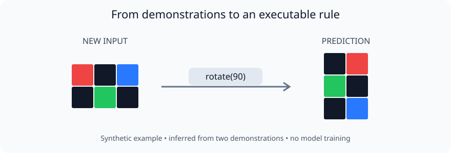

# ARC-AGI: Knowledge-Based Reasoning Agent

**3rd out of 91 students** in a graduate Knowledge-Based AI course at Georgia Tech, Fall 2024.

A Python agent that solves visual reasoning puzzles by searching for programs made of grid transformations. It represents grids as structured states, encodes domain knowledge as production rules, and reuses discovered action sequences to predict outputs from a few demonstrations.

The original submission earned **7.5/400 task-normalized points** on the public ARC-AGI evaluation set. This repository includes the original course submission and a Python package for running the solver.

## Try it

Requires Python 3.9 or newer. The solver uses the Python standard library.

```bash
git clone https://github.com/vig-star/arc-agi-kbai.git
cd arc-agi-kbai
python3 -m arc_agi_kbai demo
```

The demo infers `rotate(90)` from two synthetic examples and applies it to an unseen input. Its output includes two predictions, the selected program, and whether a fallback was used.



## How it works

1. **Represent:** store each grid as an immutable, hashable state.
2. **Generate:** enumerate production rules such as rotation, reflection, crop, scale, color mapping, flood fill, and pattern repetition.
3. **Search:** use bounded beam search, guided by cell mismatches and dimension differences, to find a program for each demonstration pair.
4. **Validate:** retain programs that reproduce every demonstration output, then rank them by frequency and length.
5. **Predict:** replay up to two programs on each test input; report an input-copy fallback when no valid program applies.

This is a symbolic program-search approach. The 2024 project explored breadth-first, heuristic best-first, and local beam search using [`py_search`](https://github.com/cmaclell/py_search). Its knowledge representations correspond to the course's frames, scripts, production systems, and planning concepts. Sequence reuse happens within each task; there is no persistent case library across tasks.

## Results

| Measure | Preserved 2024 result |
| --- | --- |
| Graduate course leaderboard | **3rd / 91 students** |
| Task-normalized evaluation score | **7.5 / 400 (1.875%)** |
| Fully solved tasks | **7 / 400** |
| Exactly predicted test grids | **9 / 419**, up to two attempts per grid |
| Project materials | [Course manuscript](docs/manuscript.pdf), [poster](docs/poster.png), [saved metrics](archive/2024/metrics.json) |

Scores give each task equal weight: a task with two test grids and one correct prediction contributes 0.5 points. The 7.5 score is independently reproducible from the saved predictions:

```bash
python3 -m arc_agi_kbai score \
  archive/2024/submission.json \
  data/arc-agi_evaluation_solutions.json
```

This command scores the saved 2024 predictions. The current package uses stricter program validation and explicit search limits, so its predictions differ from the original notebook. It solved five of eight previously scoring tasks in a targeted check; a full 400-task evaluation of the current package has not been run.

## Run the solver

Start with five training tasks:

```bash
python3 -m arc_agi_kbai solve data/arc-agi_training_challenges.json \
  --limit 5 --output outputs/training-smoke.json \
  --report outputs/training-smoke-report.json
```

For a full public evaluation run:

```bash
python3 -m arc_agi_kbai solve data/arc-agi_evaluation_challenges.json \
  --output outputs/evaluation.json --report outputs/evaluation-report.json
python3 -m arc_agi_kbai score outputs/evaluation.json \
  data/arc-agi_evaluation_solutions.json --output outputs/evaluation-score.json
```

Inference reads only challenge demonstrations and test inputs. Solutions are loaded separately by the scorer. The defaults are beam width 5, depth 6, at most 20,000 generated candidates per demonstration pair, and 5 consecutive non-improving layers. Adjust these with `--beam-width`, `--max-depth`, `--max-generated`, and `--max-sideways`. These are work limits, not a wall-clock timeout.

`--limit` selects task IDs in sorted order. Scoring a limited run against a full solution file counts omitted tasks as incorrect; it is not an estimate of full-set performance.

For an installed command, run `python3 -m pip install .` and use `arc-kbai` in place of `python3 -m arc_agi_kbai`.

## Project structure

| Path | Contents |
| --- | --- |
| [`arc_agi_kbai/`](arc_agi_kbai/) | Grid transformations, bounded search, CLI, and scorer |
| [`archive/2024/`](archive/2024/) | Original notebook and predictions, preserved byte-for-byte |
| [`data/`](data/) | Public ARC-AGI training/evaluation tasks and dataset license |
| [`docs/`](docs/) | Course manuscript, poster, and example illustration |
| [`tests/`](tests/) | Transformation, search, CLI, and historical-score regressions |

## Tests

```bash
python3 -m unittest discover -s tests -v
```

GitHub Actions runs the tests, installed demo, and historical rescoring on Python 3.9 and 3.12.

## Limitations

The low absolute score reflects a narrow hand-authored rule vocabulary. Search is bounded and incomplete; even a valid program for each individual example may not yield a shared program. Absolute crop and fill coordinates often transfer poorly. The heuristic does not guarantee an optimal program. Public evaluation results are development evidence, not a hidden-test measurement or a result on newer ARC benchmarks.

## Data and attribution

[ARC-AGI-1](https://github.com/fchollet/ARC-AGI) was created by François Chollet. The included JSON bundles contain 400 public training tasks and 400 public evaluation tasks, checked against the upstream dataset. See [data provenance](data/README.md) and the [Apache-2.0 dataset license](data/LICENSE). The school starter's “test” file duplicated public evaluation challenges and is deliberately excluded to avoid presenting it as a separate holdout.

The original notebook uses the course-provided starter and Christopher MacLellan's [`py_search`](https://github.com/cmaclell/py_search) search library. The maintained package implements its own bounded beam search using the Python standard library.
